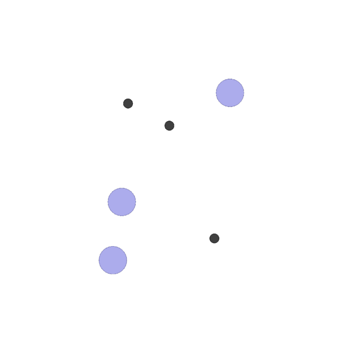

This project is a personal learning endeavor for understanding MAPPO-related concepts. The comments in the source code that start with "Luke" represent my own interpretations and explanations. Some parts of the source code are accompanied by supplementary Markdown files for detailed explanations.
For demonstrating on laptop,the trainning runs on cpu and the treads and trainning times are lower than usual. 
# 1. How to run it
## 1.1. Installation

 Here we give an example installation on CUDA == 10.1. For non-GPU & other CUDA version installation, please refer to the [PyTorch website](https://pytorch.org/get-started/locally/). We remark that this repo. does not depend on a specific CUDA version, feel free to use any CUDA version suitable on your own computer.

``` Bash
# create conda environment
conda create -n marl python==3.6.1
conda activate marl
pip install torch==1.5.1+cu101 torchvision==0.6.1+cu101 -f https://download.pytorch.org/whl/torch_stable.html
```

```
# install on-policy package
cd on-policy
pip install -e .
```

Even though we provide requirement.txt, it may have redundancy. We recommend that the user try to install other required packages by running the code and finding which required package hasn't installed yet.

### 1.1.1. MPE

``` Bash
# install this package first
pip install seaborn
```

There are 3 Cooperative scenarios in MPE:

* simple_spread
* simple_speaker_listener, which is 'Comm' scenario in paper
* simple_reference

## 1.2. Training
Here we use train_mpe_spread.sh as an example:
```
cd onpolicy/scripts/train_mpe_scripts
chmod +x ./train_mpe_spread.sh
./train_mpe_spread.sh
```
Local results are stored in subfold scripts/results. Note that we use Weights & Bias as the default visualization platform; to use Weights & Bias, please register and login to the platform first. More instructions for using Weights&Bias can be found in the official [documentation](https://docs.wandb.ai/). Adding the `--use_wandb` in command line or in the .sh file will use Tensorboard instead of Weights & Biases. 

# 2. Process 
The codebase follows a structured flow that can be articulated through several critical phases:

## 2.1. Environment Initialization (`MPE_env.py`, `simple_spread.py`, `environment.py`):

- **Scenario Definition** (`simple_spread.py`): The first step involves defining specific scenarios for multi-agent environments, such as the "Simple Spread" task. This file outlines the tasks that agents are required to complete within the environment.
- **Environment Setup** (`MPE_env.py`): Subsequently, the environment is instantiated based on the scenarios. This setup determines how multiple agents will interact and what rules govern these interactions.
- **Environment Management** (`environment.py`): Core functions such as resetting the environment, advancing steps, and rendering states are managed here. This module ensures that the environment operates according to the specifications defined in the setup phase.

## 2.2. Policy Initialization (`rMAPPOPolicy.py`, `r_actor_critic.py`):

- **Actor-Critic Architecture** (`r_actor_critic.py`): The neural network architecture that underpins the Actor-Critic model is defined here. The Actor network is responsible for action selection, while the Critic network evaluates the value of the selected actions.
- **MAPPO Policy** (`rMAPPOPolicy.py`): This module implements the Multi-Agent Proximal Policy Optimization (MAPPO) algorithm. It leverages the Actor-Critic architecture to manage policy updates across multiple agents, ensuring coordinated decision-making in a multi-agent setting.

## 2.3. Training Loop (`r_mappo.py`, `base_runner.py`, `mpe_runner.py`):

- **MAPPO Algorithm Implementation** (`r_mappo.py`): The core training algorithm is executed within this module. It involves collecting experiences from the environment, calculating the loss, and updating the policy iteratively. The interaction between agents and the environment is central to this phase.
- **Training Management** (`mpe_runner.py`, `base_runner.py`): These runner modules oversee the execution of the training process. They handle the initialization of agents and environments, manage the training loop, and ensure that data is logged and saved appropriately.

## 2.4. Training Execution (`train_mpe.py`):

- **Main Training Script**: This script serves as the entry point for the entire project. It integrates the various components—environment, policy, and training management—into a cohesive process. The script initiates the environment, sets up the agents, and executes the training loop until the desired convergence is achieved.

# 3. Structure
The structure of the codebase is deliberately modular, facilitating ease of maintenance and scalability. The codebase is organized into the following primary components:

## 3.1. Environment Module (`MPE_env.py`, `simple_spread.py`, `environment.py`):

- **Objective**: To define and manage the multi-agent environment, including the rules of interaction and the tasks to be performed by the agents.
- **Structure**:
  - **`simple_spread.py`**: Defines specific multi-agent tasks and the rules governing agent behavior.
  - **`MPE_env.py`**: Manages the instantiation and configuration of different environment scenarios, providing a unified interface for interaction.
  - **`environment.py`**: Implements fundamental environment operations such as resetting, stepping through time, and visualizing the state.

## 3.2. Policy Module (`rMAPPOPolicy.py`, `r_actor_critic.py`):

- **Objective**: To define and manage the policies governing agent behavior, particularly through the Actor-Critic architecture.
- **Structure**:
  - **`r_actor_critic.py`**: Establishes the neural network architecture used for both the Actor and Critic, which are central to decision-making and value estimation in reinforcement learning.
  - **`rMAPPOPolicy.py`**: Implements the MAPPO algorithm, adapting the Actor-Critic framework for a multi-agent context and ensuring that policy updates account for the interactions between agents.

## 3.3. Algorithm Module (`r_mappo.py`):

- **Objective**: To execute the MAPPO algorithm, facilitating the iterative process of experience collection, loss computation, and policy optimization.
- **Structure**:
  - **`r_mappo.py`**: Serves as the core algorithmic engine of the project, interacting with both the policy and environment modules to conduct training.

## 3.4. Training Management Module (`base_runner.py`, `mpe_runner.py`):

- **Objective**: To manage the overall training process, ensuring that each component is properly initialized and that the training loop is executed effectively.
- **Structure**:
  - **`base_runner.py`**: Provides a generalized framework for running training sessions, handling the iteration over multiple episodes and the collection of performance metrics.
  - **`mpe_runner.py`**: Specializes the general runner for multi-agent environments, tailoring the training process to the specific needs of scenarios like those defined in `simple_spread.py`.

## 3.5. Main Script (`train_mpe.py`):

- **Objective**: To integrate all modules and initiate the training process, serving as the operational entry point for the entire project.
- **Structure**:
  - **`train_mpe.py`**: Combines environment initialization, policy setup, and the training loop into a cohesive sequence, executing the defined training regimen from start to finish.


# 4. Case Study
There is no other way could be better than a case study to understand it quick and deeply.
This case is based on scripts/train_mpe_scripts/case_study_train_mpe_spread.sh script.


**<center>Simple Spread</center>**

```
scenario="simple_spread" 
num_landmarks=3
num_agents=3
algo="mappo"
```

This environment has 3 agents(big violet circle), 3 landmarks (small black circle). 
At a high level, agents must learn to cover all the landmarks while avoiding collisions.

More specifically, all agents are globally rewarded based on how far the closest agent is to each landmark (sum of the minimum distances). Locally, the agents are penalized if they collide with other agents (-1 for each collision). The relative weights of these rewards can be controlled with the local_ratio parameter.

Agent observations: [self_vel, self_pos, landmark_rel_positions, other_agent_rel_positions, communication]

Agent action space: [no_action, move_left, move_right, move_down, move_up]


```
--n_rollout_threads 1 --num_mini_batch 1 --episode_length 12 --num_env_steps 2000 \
    --ppo_epoch 10 --use_ReLU --gain 0.01 --lr 7e-4 --critic_lr 7e-4
```
Other configrations like Rollout threads number, episode length, and environment steps are down to an example level.

Then we initialize the training and evaluation environments
```
    # Luke: Initialize the training and evaluation environments.
    envs = make_train_env(all_args)
    eval_envs = make_eval_env(all_args) if all_args.use_eval else None
    num_agents = all_args.num_agents
```
```
def make_train_env(all_args):
    # Luke: This function creates the environment for training.
    # Luke: It determines whether to use a single-threaded or multi-threaded environment setup.
    def get_env_fn(rank):
        def init_env():
            # Luke: Initialize the MPE environment based on the provided arguments.
            if all_args.env_name == "MPE":
                env = MPEEnv(all_args)
            else:
                # Luke: Raise an error if the environment name is not supported.
                print("Can not support the " +
                      all_args.env_name + "environment.")
                raise NotImplementedError
            # Luke: Set the seed for the environment, ensuring reproducibility.
            env.seed(all_args.seed + rank * 1000)
            return env
        return init_env

    # Luke: Return either a single-threaded (DummyVecEnv) or 
    # multi-threaded (SubprocVecEnv) environment based on the number of rollout threads.
    if all_args.n_rollout_threads == 1:
        return DummyVecEnv([get_env_fn(0)])
    else:
        return SubprocVecEnv([get_env_fn(i) for i in range(all_args.n_rollout_threads)])
```
Our rollout_threads is 1, so we only create a DummyVecEnv([get_env_fn(0)]), which equals 
```
env = MPEEnv(all_args)
env.seed(1)
```
```
def make_eval_env(all_args):
    # Luke: This function creates the environment for evaluation.
    # Luke: Similar to make_train_env, but with different 
    # seeding to ensure evaluation is independent of training.
    def get_env_fn(rank):
        def init_env():
            # Luke: Initialize the MPE environment based on the provided arguments.
            if all_args.env_name == "MPE":
                env = MPEEnv(all_args)
            else:
                # Luke: Raise an error if the environment name is not supported.
                print("Can not support the " +
                      all_args.env_name + "environment.")
                raise NotImplementedError
            # Luke: Set the seed for the evaluation environment.
            env.seed(all_args.seed * 50000 + rank * 10000)
            return env
        return init_env

    # Luke: Return either a single-threaded (DummyVecEnv) or 
    # multi-threaded (SubprocVecEnv) environment based on the number of evaluation rollout threads.
    if all_args.n_eval_rollout_threads == 1:
        return DummyVecEnv([get_env_fn(0)])
    else:
        return SubprocVecEnv([get_env_fn(i) for i in range(all_args.n_eval_rollout_threads)])
```
Our rollout_threads is 1, so we only create a DummyVecEnv([get_env_fn(0)]), which equals 
```
env = MPEEnv(all_args)
env.seed(50000)
```
MPEEnv is combined by 

envs/MPE_env.py 

envs/environment.py 

envs/core.py 

envs/mpe/scenario.py 

envs/mpe/scenarios/simple_spread.py

gym.Env

It's a giant class. Most codes are used to make the world, including agents, landmarks and moving, works.

Here is some important codes about rewards and observation:
In envs/mpe/scenarios/simple_spread.py
```
    def reward(self, agent, world):
        # Agents are rewarded based on minimum agent distance to each landmark, penalized for collisions
        # Luke: Initialize the reward variable
        rew = 0

        # Luke: Calculate and accumulate rewards based on the minimum distance from any agent to each landmark
        for l in world.landmarks:
            dists = [np.sqrt(np.sum(np.square(a.state.p_pos - l.state.p_pos)))
                     for a in world.agents]
            rew -= min(dists)

        # Luke: Penalize the agent if it collides with other agents
        if agent.collide:
            for a in world.agents:
                if self.is_collision(a, agent):
                    rew -= 1

        # Luke: Return the calculated reward
        return rew

    def observation(self, agent, world):
        # get positions of all entities in this agent's reference frame
        # Luke: Gather the positions of all landmarks relative to the agent's position
        entity_pos = []
        for entity in world.landmarks:  # world.entities:
            entity_pos.append(entity.state.p_pos - agent.state.p_pos)

        # entity colors
        # Luke: Gather the colors of all landmarks
        entity_color = []
        for entity in world.landmarks:  # world.entities:
            entity_color.append(entity.color)

        # communication of all other agents
        # Luke: Gather the communication states and positions of all other agents relative to this agent
        comm = []
        other_pos = []
        for other in world.agents:
            if other is agent:
                continue
            comm.append(other.state.c)
            other_pos.append(other.state.p_pos - agent.state.p_pos)

        # Luke: Return a concatenated array of the agent's velocity, position, 
        # relative positions of entities, and communication states
        # return np.concatenate([agent.state.p_vel] + [agent.state.p_pos] + entity_pos + other_pos + comm)
```
Calculate the reward for an agent based on its proximity to landmarks and penalizes it for collisions. The reward is determined by the minimum distance between any agent and each landmark, with a deduction for any collisions between the agent and others.

Anditionaly, generate the observation for an agent, which includes the positions of all landmarks relative to the agent, the colors of the landmarks, and the positions and communication states of other agents relative to the agent. This observation is returned as a concatenated array of relevant state information.

Next, makes the MPERunner:
```
    if all_args.share_policy:
        from onpolicy.runner.shared.mpe_runner import MPERunner as Runner
    else:
        from onpolicy.runner.separated.mpe_runner import MPERunner as Runner

    runner = Runner(config)
```
Since the shared policy is default True (see config.py), the Runner is onpolicy.runner.shared.mpe_runner.
After warmup (initiate) is lr_decay
```
            # Luke: Apply linear learning rate decay if it's enabled in the configuration.
            if self.use_linear_lr_decay:
                self.trainer.policy.lr_decay(episode, episodes)
```
update learning rate for both actor and critic. initial_lr is 7e-4 for both for each episode. 
```
def update_linear_schedule(optimizer, epoch, total_num_epochs, initial_lr):
    """Decreases the learning rate linearly"""
    lr = initial_lr - (initial_lr * (epoch / float(total_num_epochs)))
    for param_group in optimizer.param_groups:
        param_group['lr'] = lr
```
Optimizer is Adam optimizer (It has been proposed in _`Adam: A Method for Stochastic Optimization`_.).
```
        # Luke: Set up the optimizer for the actor network using Adam, 
        # with learning rate, epsilon, and weight decay.
        self.actor_optimizer = torch.optim.Adam(self.actor.parameters(),
                                                lr=self.lr, eps=self.opti_eps,
                                                weight_decay=self.weight_decay)
        # Luke: Set up the optimizer for the critic network using Adam, 
        # with learning rate, epsilon, and weight decay.
        self.critic_optimizer = torch.optim.Adam(self.critic.parameters(),
                                                 lr=self.critic_lr,
                                                 eps=self.opti_eps,
                                                 weight_decay=self.weight_decay)
```
Collect, step, insert data in each step.
```
            for step in range(self.episode_length):
                # Sample actions
                # Luke: Collect data by sampling actions from the policy.
                values, actions, action_log_probs, rnn_states, rnn_states_critic, \
                    actions_env = self.collect(step)
```
Collect data, including values, actions, action_log_probs, rnn_states, rnn_states_critic, and actions_env.
```
@torch.no_grad()
    def collect(self, step):
        # Luke: Prepare the trainer for rollout (e.g., set the model to evaluation mode).
        self.trainer.prep_rollout()
        # Luke: Get the actions, values, and log probabilities from the policy's action distribution.
        value, action, action_log_prob, rnn_states, rnn_states_critic \
            = self.trainer.policy.get_actions(np.concatenate(self.buffer.share_obs[step]),
                            np.concatenate(self.buffer.obs[step]),
                            np.concatenate(self.buffer.rnn_states[step]),
                            np.concatenate(self.buffer.rnn_states_critic[step]),
                            np.concatenate(self.buffer.masks[step]))
        # [self.envs, agents, dim]
        # Luke: Convert the collected values, actions, and log probabilities to 
        # numpy arrays and split them by rollout threads.
        values = np.array(np.split(_t2n(value), self.n_rollout_threads))
        actions = np.array(np.split(_t2n(action), self.n_rollout_threads))
        action_log_probs = np.array(np.split(_t2n(action_log_prob), self.n_rollout_threads))
        rnn_states = np.array(np.split(_t2n(rnn_states), self.n_rollout_threads))
        rnn_states_critic = np.array(np.split(_t2n(rnn_states_critic), self.n_rollout_threads))
        # rearrange action
        # Luke: Rearrange the actions to match the environment's action space format.
        if self.envs.action_space[0].__class__.__name__ == 'MultiDiscrete':
            for i in range(self.envs.action_space[0].shape):
                uc_actions_env = np.eye(self.envs.action_space[0].high[i] + 1)[actions[:, :, i]]
                if i == 0:
                    actions_env = uc_actions_env
                else:
                    actions_env = np.concatenate((actions_env, uc_actions_env), axis=2)
        elif self.envs.action_space[0].__class__.__name__ == 'Discrete':
            actions_env = np.squeeze(np.eye(self.envs.action_space[0].n)[actions], 2)
        else:
            raise NotImplementedError

        return values, actions, action_log_probs, rnn_states, rnn_states_critic, actions_env
```
Make the environment to step.
```    
                # Obser reward and next obs
                # Luke: Execute the actions in the environment and observe the results 
                # (next observations, rewards, done flags, and info).
                obs, rewards, dones, infos = self.envs.step(actions_env)
```
In envs/MPE_env.py 
```
   # step  this is  env.step()
    def step(self, action_n):
        # Luke: Update the environment by one step. Track the current step, 
        # and prepare to collect observations, rewards, done flags, and info for each agent.
        # Luke: Track the number of steps in the current episode.
        self.current_step += 1
        # Luke: Store observations for each agent.
        obs_n = []
        # Luke: Store rewards for each agent.
        reward_n = []
        # Luke: Store done flags for each agent.
        done_n = []
        # Luke: Store additional information for each agent.
        info_n = []
        # Luke: Update the list of active agents.
        self.agents = self.world.policy_agents

        # set action for each agent
        # Luke: For each agent, set the action based on the provided action space.
        for i, agent in enumerate(self.agents):
            self._set_action(action_n[i], agent, self.action_space[i])
        
        # advance world state
        # Luke: Advance the state of the world by one step.
        self.world.step()  # core.step() in envs/core.py 
        
        # record observation for each agent
        # Luke: For each agent, collect the observation, reward, 
        # done flag, and additional info. If the agent fails, record it in the info.
        for i, agent in enumerate(self.agents):
            obs_n.append(self._get_obs(agent))
            reward_n.append([self._get_reward(agent)])
            done_n.append(self._get_done(agent))
            info = {'individual_reward': self._get_reward(agent)}
            env_info = self._get_info(agent)
            if 'fail' in env_info.keys():
                info['fail'] = env_info['fail']
            info_n.append(info)

        # all agents get total reward in cooperative case, if shared reward, 
        # all agents have the same reward, and reward is sum
        reward = np.sum(reward_n)
        if self.shared_reward:
            reward_n = [[reward]] * self.n

        # Luke: If a post-step callback is defined, call it.
        # The post-step callback is executed after the environment's state
        # has been updated and rewards, observations, and done flags have been calculated.
        # It allows for any additional processing or custom logic that should occur at the end
        # of each step, such as logging, modifying the environment, or applying global effects.
        if self.post_step_callback is not None:
            self.post_step_callback(self.world)
        
        # Luke: Return the collected observations, rewards, done flags, and info for all agents
        return obs_n, reward_n, done_n, info_n
```
Insert all the data from the previous steps into the buffer.
```
                # Luke: Package the collected data into a tuple 
                # for easy insertion into the buffer.
                data = obs, rewards, dones, infos, values, \
                    actions, action_log_probs, rnn_states, rnn_states_critic

                # insert data into buffer
                # Luke: Insert the collected data into the buffer.
                self.insert(data)
```
Details of insertation:
```
    def insert(self, data):
        # Luke: Unpack the data tuple into individual components.
        obs, rewards, dones, infos, values, actions, action_log_probs, rnn_states, rnn_states_critic = data

        # Luke: Reset RNN states for agents that are done.
        rnn_states[dones == True] = np.zeros(((dones == True).sum(), \
            self.recurrent_N, self.hidden_size), dtype=np.float32)
        rnn_states_critic[dones == True] = np.zeros(((dones == True).sum(), \
            *self.buffer.rnn_states_critic.shape[3:]), dtype=np.float32)
        # Luke: Create masks to indicate whether an agent is done or not.
        masks = np.ones((self.n_rollout_threads, self.num_agents, 1), dtype=np.float32)
        masks[dones == True] = np.zeros(((dones == True).sum(), 1), dtype=np.float32)

        # Luke: Prepare the shared observations based on whether centralized value functions are used.
        if self.use_centralized_V:
            share_obs = obs.reshape(self.n_rollout_threads, -1)
            share_obs = np.expand_dims(share_obs, 1).repeat(self.num_agents, axis=1)
        else:
            share_obs = obs

        # Luke: Insert the collected data into the buffer.
        self.buffer.insert(share_obs, obs, rnn_states, rnn_states_critic, \
            actions, action_log_probs, values, rewards, masks)
```

Than, compute, train, and eval it.
```
            # compute return and update network
            # Luke: After the episode, compute the returns and update the network.
            self.compute()
```
```
    @torch.no_grad()
    def compute(self):
        """Calculate returns for the collected data."""
        # Luke: Prepare the trainer for rollout (e.g., set the model to evaluation mode).
        self.trainer.prep_rollout()
        # Luke: Get the estimated value of the next state from the policy's critic network.
        next_values = self.trainer.policy.get_values(np.concatenate(self.buffer.share_obs[-1]),
                                                np.concatenate(self.buffer.rnn_states_critic[-1]),
                                                np.concatenate(self.buffer.masks[-1]))
```
To compute it, we need to get value first:
```
    def get_values(self, cent_obs, rnn_states_critic, masks):
        """
        Get value function predictions.
        :param cent_obs (np.ndarray): centralized input to the critic.
        :param rnn_states_critic: (np.ndarray) if critic is RNN, RNN states for critic.
        :param masks: (np.ndarray) denotes points at which RNN states should be reset.

        :return values: (torch.Tensor) value function predictions.
        """
        # Luke: Compute value predictions using the critic network without updating RNN states.
        values, _ = self.critic(cent_obs, rnn_states_critic, masks)
        return values
```
It is values and a MLP Network.
```
class R_Critic(nn.Module):
    """
    Critic network class for MAPPO. Outputs value function predictions given centralized input (MAPPO) or
                            local observations (IPPO).
    :param args: (argparse.Namespace) arguments containing relevant model information.
    :param cent_obs_space: (gym.Space) (centralized) observation space.
    :param device: (torch.device) specifies the device to run on (cpu/gpu).
    """
    def __init__(self, args, cent_obs_space, device=torch.device("cpu")):
        # Luke: Initialize the parent class nn.Module.
        super(R_Critic, self).__init__()
        # Luke: Store the hidden layer size from the arguments.
        self.hidden_size = args.hidden_size
        # Luke: Store whether orthogonal initialization should be used.
        self._use_orthogonal = args.use_orthogonal
        # Luke: Store whether to use a naive recurrent policy.
        self._use_naive_recurrent_policy = args.use_naive_recurrent_policy
        # Luke: Store whether to use a recurrent policy.
        self._use_recurrent_policy = args.use_recurrent_policy
        # Luke: Store the number of recurrent layers to be used.
        self._recurrent_N = args.recurrent_N
        # Luke: Store whether to use PopArt normalization for value output.
        self._use_popart = args.use_popart
        # Luke: Set the dtype and device for tensors.
        self.tpdv = dict(dtype=torch.float32, device=device)
        # Luke: Choose initialization method based on orthogonal initialization flag.
        init_method = [nn.init.xavier_uniform_, nn.init.orthogonal_][self._use_orthogonal]

        # Luke: Determine the shape of the centralized observation based on the observation space.
        cent_obs_shape = get_shape_from_obs_space(cent_obs_space)
        # Luke: Choose the base network architecture 
        # (CNNBase for images, MLPBase for others) based on observation shape.
        base = CNNBase if len(cent_obs_shape) == 3 else MLPBase
        # Luke: Initialize the base network with the selected architecture and centralized observation shape.
        self.base = base(args, cent_obs_shape)

        # Luke: Initialize the RNN layer if using a recurrent policy.
        if self._use_naive_recurrent_policy or self._use_recurrent_policy:
            self.rnn = RNNLayer(self.hidden_size, self.hidden_size, self._recurrent_N, self._use_orthogonal)

        def init_(m):
            # Luke: Initialize the given module with the selected initialization method.
            return init(m, init_method, lambda x: nn.init.constant_(x, 0))

        # Luke: Initialize the output layer for value prediction, using PopArt if specified.
        if self._use_popart:
            self.v_out = init_(PopArt(self.hidden_size, 1, device=device))
        else:
            self.v_out = init_(nn.Linear(self.hidden_size, 1))

        # Luke: Move the model to the specified device (CPU/GPU).
        self.to(device)
```

```
        # Luke: Split the concatenated next values into separate arrays for each rollout thread.
        next_values = np.array(np.split(_t2n(next_values), self.n_rollout_threads))
        # Luke: Compute the returns based on the next values and update the buffer.
        self.buffer.compute_returns(next_values, self.trainer.value_normalizer)
```
In shared_buffer.py, use_gae default is True, use_proper_time_limits default is False, and use_popart default is Ture:
```
    def compute_returns(self, next_value, value_normalizer=None):
        """
        Compute returns either as discounted sum of rewards, or using GAE.
        :param next_value: (np.ndarray) value predictions for the step after the last episode step.
        :param value_normalizer: (PopArt) If not None, PopArt value normalizer instance.
        """
            if self._use_gae:
                self.value_preds[-1] = next_value
                gae = 0
                for step in reversed(range(self.rewards.shape[0])):
                    if self._use_popart or self._use_valuenorm:
                        delta = self.rewards[step] + self.gamma * value_normalizer.denormalize(
                            self.value_preds[step + 1]) * self.masks[step + 1] \
                                - value_normalizer.denormalize(self.value_preds[step])
                        gae = delta + self.gamma * self.gae_lambda * self.masks[step + 1] * gae
                        self.returns[step] = gae + value_normalizer.denormalize(self.value_preds[step])
            train_infos = self.train()
```
In algorithms/r_mappo.py, we train the model. This is the core algorithem of PPO.
Calculate the value function loss by clipping the predicted values to ensure stability in value updates.
```

    def cal_value_loss(self, values, value_preds_batch, return_batch, active_masks_batch):
        """
        Calculate value function loss.
        :param values: (torch.Tensor) value function predictions.
        :param value_preds_batch: (torch.Tensor) "old" value predictions 
            from data batch (used for value clip loss)
        :param return_batch: (torch.Tensor) reward to go returns.
        :param active_masks_batch: (torch.Tensor) denotes if agent is active or dead at a given timestep.

        :return value_loss: (torch.Tensor) value function loss.
        """
        # Luke: Compute the clipped value predictions by constraining the change from old predictions.
        value_pred_clipped = value_preds_batch + (values - value_preds_batch).clamp(-self.clip_param,
                                                                                   self.clip_param)
        # Luke: Normalize the return batch if popart or valuenorm is used, then compute errors.
        if self._use_popart or self._use_valuenorm:
            self.value_normalizer.update(return_batch)
            error_clipped = self.value_normalizer.normalize(return_batch) - value_pred_clipped
            error_original = self.value_normalizer.normalize(return_batch) - values
        else:
            error_clipped = return_batch - value_pred_clipped
            error_original = return_batch - values

        # Luke: Calculate the value loss using either Huber loss or MSE loss.
        if self._use_huber_loss:
            value_loss_clipped = huber_loss(error_clipped, self.huber_delta)
            value_loss_original = huber_loss(error_original, self.huber_delta)
        else:
            value_loss_clipped = mse_loss(error_clipped)
            value_loss_original = mse_loss(error_original)

        # Luke: Use the maximum of original and clipped value losses if specified.
        if self._use_clipped_value_loss:
            value_loss = torch.max(value_loss_original, value_loss_clipped)
        else:
            value_loss = value_loss_original

        # Luke: Apply active masks if specified to calculate the mean value loss.
        if self._use_value_active_masks:
            value_loss = (value_loss * active_masks_batch).sum() / active_masks_batch.sum()
        else:
            value_loss = value_loss.mean()

        return value_loss
```
Limit the policy updates to prevent large changes that could destabilize the learning process. The _imp_weights_ compute the probability ratio between the new and old policies, and the _surr1_ and _surr2_ terms calculate the surrogate objective. The minimum of these is taken as the policy loss, which is then used for gradient backpropagation and optimization.
```
    def ppo_update(self, sample, update_actor=True):
        """
        Update actor and critic networks.
        :param sample: (Tuple) contains data batch with which to update networks.
        :param update_actor: (bool) whether to update actor network.

        :return value_loss: (torch.Tensor) value function loss.
        :return critic_grad_norm: (torch.Tensor) gradient norm from critic update.
        :return policy_loss: (torch.Tensor) actor(policy) loss value.
        :return dist_entropy: (torch.Tensor) action entropies.
        :return actor_grad_norm: (torch.Tensor) gradient norm from actor update.
        :return imp_weights: (torch.Tensor) importance sampling weights.
        """
        # Luke: Unpack the data sample.
        share_obs_batch, obs_batch, rnn_states_batch, rnn_states_critic_batch, actions_batch, \
        value_preds_batch, return_batch, masks_batch, active_masks_batch, old_action_log_probs_batch, \
        adv_targ, available_actions_batch = sample

        # Luke: Prepare the tensors for computation by moving them to the appropriate device.
        old_action_log_probs_batch = check(old_action_log_probs_batch).to(**self.tpdv)
        adv_targ = check(adv_targ).to(**self.tpdv)
        value_preds_batch = check(value_preds_batch).to(**self.tpdv)
        return_batch = check(return_batch).to(**self.tpdv)
        active_masks_batch = check(active_masks_batch).to(**self.tpdv)

        # Reshape to do in a single forward pass for all steps
        # Luke: Perform a forward pass to get the values, action log probabilities, and entropy for all steps.
        values, action_log_probs, dist_entropy = self.policy.evaluate_actions(share_obs_batch,
                                                                              obs_batch, 
                                                                              rnn_states_batch, 
                                                                              rnn_states_critic_batch, 
                                                                              actions_batch, 
                                                                              masks_batch, 
                                                                              available_actions_batch,
                                                                              active_masks_batch)
```
Fllowing is the core part of PPO algorithm:
```
        # actor update
        # Luke: Update the actor by calculating the importance sampling weights.
        imp_weights = torch.exp(action_log_probs - old_action_log_probs_batch)

        # Luke: Calculate the surrogate loss functions for the policy.
        surr1 = imp_weights * adv_targ
        surr2 = torch.clamp(imp_weights, 1.0 - self.clip_param, 1.0 + self.clip_param) * adv_targ

        # Luke: Calculate the policy action loss, considering active masks if specified.
        if self._use_policy_active_masks:
            policy_action_loss = (-torch.sum(torch.min(surr1, surr2),
                                             dim=-1,
                                             keepdim=True) * active_masks_batch).sum() \
                                                /  active_masks_batch.sum()
        else:
            policy_action_loss = -torch.sum(torch.min(surr1, surr2), dim=-1, keepdim=True).mean()

        policy_loss = policy_action_loss

        # Luke: Zero the gradients for the actor optimizer before updating.
        self.policy.actor_optimizer.zero_grad()

        # Luke: Perform backpropagation for the policy loss if actor update is enabled.
        if update_actor:
            (policy_loss - dist_entropy * self.entropy_coef).backward()

        # Luke: Clip the gradients if max grad norm is enabled, otherwise calculate the gradient norm.
        if self._use_max_grad_norm:
            actor_grad_norm = nn.utils.clip_grad_norm_(self.policy.actor.parameters(), self.max_grad_norm)
        else:
            actor_grad_norm = get_gard_norm(self.policy.actor.parameters())

        # Luke: Step the actor optimizer to apply the gradient update.
        self.policy.actor_optimizer.step()
```

```
        # critic update
        # Luke: Update the critic by calculating the value loss.
        value_loss = self.cal_value_loss(values, value_preds_batch, return_batch, active_masks_batch)
```

```
        # Luke: Zero the gradients for the critic optimizer before updating.
        self.policy.critic_optimizer.zero_grad()

        # Luke: Backpropagate the value loss scaled by the value loss coefficient.
        (value_loss * self.value_loss_coef).backward()

        # Luke: Clip the gradients for the critic if max grad norm is enabled, 
        # otherwise calculate the gradient norm.
        if self._use_max_grad_norm:
            critic_grad_norm = nn.utils.clip_grad_norm_(self.policy.critic.parameters(), self.max_grad_norm)
        else:
            critic_grad_norm = get_gard_norm(self.policy.critic.parameters())

        # Luke: Step the critic optimizer to apply the gradient update.
        self.policy.critic_optimizer.step()

        # Luke: Return the losses, gradient norms, entropy, and importance weights for logging.
        return value_loss, critic_grad_norm, policy_loss, dist_entropy, actor_grad_norm, imp_weights

    def train(self, buffer, update_actor=True):
        """
        Perform a training update using minibatch GD.
        :param buffer: (SharedReplayBuffer) buffer containing training data.
        :param update_actor: (bool) whether to update actor network.

        :return train_info: (dict) contains information regarding 
            training update (e.g. loss, grad norms, etc).
        """
        # Luke: Compute the advantages for the training data.
        if self._use_popart or self._use_valuenorm:
            advantages = buffer.returns[:-1] - self.value_normalizer.denormalize(buffer.value_preds[:-1])
        else:
            advantages = buffer.returns[:-1] - buffer.value_preds[:-1]
        
        # Luke: Copy the advantages and mask inactive agents.
        advantages_copy = advantages.copy()
        advantages_copy[buffer.active_masks[:-1] == 0.0] = np.nan
        
        # Luke: Normalize the advantages using mean and standard deviation.
        mean_advantages = np.nanmean(advantages_copy)
        std_advantages = np.nanstd(advantages_copy)
        advantages = (advantages - mean_advantages) / (std_advantages + 1e-5)
        
        # Luke: Initialize a dictionary to store the training information.
        train_info = {}

        train_info['value_loss'] = 0
        train_info['policy_loss'] = 0
        train_info['dist_entropy'] = 0
        train_info['actor_grad_norm'] = 0
        train_info['critic_grad_norm'] = 0
        train_info['ratio'] = 0

        # Luke: Perform training updates for the number of PPO epochs specified.
        for _ in range(self.ppo_epoch):
            # Luke: Use the appropriate data generator based on the policy type.
            if self._use_recurrent_policy:
                data_generator = buffer.recurrent_generator(advantages, \
                    self.num_mini_batch, self.data_chunk_length)
            elif self._use_naive_recurrent:
                data_generator = buffer.naive_recurrent_generator(advantages, self.num_mini_batch)
            else:
                data_generator = buffer.feed_forward_generator(advantages, self.num_mini_batch)
```
This loop iterates through several epochs and uses a data generator to provide minibatch data for the updates, ensuring a stable training process by gradually updating the policy and value function.
```
            # Luke: Iterate over the samples generated by the data generator.
            for sample in data_generator:
                # Luke: Perform a PPO update with the current sample.
                value_loss, critic_grad_norm, policy_loss, dist_entropy, actor_grad_norm, imp_weights \
                    = self.ppo_update(sample, update_actor)
```
```
                # Luke: Accumulate the losses and gradient norms for logging.
                train_info['value_loss'] += value_loss.item()
                train_info['policy_loss'] += policy_loss.item()
                train_info['dist_entropy'] += dist_entropy.item()
                train_info['actor_grad_norm'] += actor_grad_norm
                train_info['critic_grad_norm'] += critic_grad_norm
                train_info['ratio'] += imp_weights.mean()

        # Luke: Calculate the average of the accumulated values by dividing by the number of updates.
        num_updates = self.ppo_epoch * self.num_mini_batch

        for k in train_info.keys():
            train_info[k] /= num_updates

        # Luke: Return the training information after the update.
        return train_info

    def prep_training(self):
        # Luke: Set the actor and critic to training mode.
        self.policy.actor.train()
        self.policy.critic.train()

    def prep_rollout(self):
        # Luke: Set the actor and critic to evaluation mode for rollout.
        self.policy.actor.eval()
        self.policy.critic.eval()
```
In the end, evalute the process result.
```
            # eval
            # Luke: Evaluate the policy at specified intervals if evaluation is enabled.
            if episode % self.eval_interval == 0 and self.use_eval:
                self.eval(total_num_steps)
```
```
    @torch.no_grad()
    def eval(self, total_num_steps):
        # Luke: Initialize a list to store rewards for evaluation episodes.
        eval_episode_rewards = []
        # Luke: Reset the evaluation environments to get initial observations.
        eval_obs = self.eval_envs.reset()

        # Luke: Initialize RNN states and masks for the evaluation episodes.
        eval_rnn_states = np.zeros((self.n_eval_rollout_threads, \
            *self.buffer.rnn_states.shape[2:]), dtype=np.float32)
        eval_masks = np.ones((self.n_eval_rollout_threads, self.num_agents, 1), dtype=np.float32)

        for eval_step in range(self.episode_length):
            # Luke: Prepare the trainer for rollout and perform actions deterministically during evaluation.
            self.trainer.prep_rollout()
            eval_action, eval_rnn_states = self.trainer.policy.act(np.concatenate(eval_obs),
                                                np.concatenate(eval_rnn_states),
                                                np.concatenate(eval_masks),
                                                deterministic=True)
            eval_actions = np.array(np.split(_t2n(eval_action), self.n_eval_rollout_threads))
            eval_rnn_states = np.array(np.split(_t2n(eval_rnn_states), self.n_eval_rollout_threads))
            
            # Luke: Rearrange the evaluation actions to match the environment's action space format.
            if self.eval_envs.action_space[0].__class__.__name__ == 'MultiDiscrete':
                for i in range(self.eval_envs.action_space[0].shape):
                    eval_uc_actions_env = \
                        np.eye(self.eval_envs.action_space[0].high[i]+1)[eval_actions[:, :, i]]
                    if i == 0:
                        eval_actions_env = eval_uc_actions_env
                    else:
                        eval_actions_env = np.concatenate((eval_actions_env, eval_uc_actions_env), axis=2)
            elif self.eval_envs.action_space[0].__class__.__name__ == 'Discrete':
                eval_actions_env = np.squeeze(np.eye(self.eval_envs.action_space[0].n)[eval_actions], 2)
            else:
                raise NotImplementedError

            # Obser reward and next obs
            # Luke: Execute the evaluation actions in the environment and observe the results.
            eval_obs, eval_rewards, eval_dones, eval_infos = self.eval_envs.step(eval_actions_env)
            eval_episode_rewards.append(eval_rewards)

            # Luke: Reset RNN states for agents that are done during evaluation.
            eval_rnn_states[eval_dones == True] = \
                np.zeros(((eval_dones == True).sum(), self.recurrent_N, self.hidden_size), dtype=np.float32)
            eval_masks = np.ones((self.n_eval_rollout_threads, self.num_agents, 1), dtype=np.float32)
            eval_masks[eval_dones == True] = np.zeros(((eval_dones == True).sum(), 1), dtype=np.float32)

        # Luke: Calculate the total rewards for evaluation episodes.
        eval_episode_rewards = np.array(eval_episode_rewards)
        eval_env_infos = {}
        eval_env_infos['eval_average_episode_rewards'] = np.sum(np.array(eval_episode_rewards), axis=0)
        eval_average_episode_rewards = np.mean(eval_env_infos['eval_average_episode_rewards'])
        print("eval average episode rewards of agent: " + str(eval_average_episode_rewards))
        # Luke: Log the evaluation results.
        self.log_env(eval_env_infos, total_num_steps)
```
Finally, You can find the trained data in the results/MPE/simple_spread/mappo/check/wandb/run-{time}/files directory.

___


Original repo address is https://github.com/marlbenchmark/on-policy. 

Following is the original Readme.md
# MAPPO

Chao Yu*, Akash Velu*, Eugene Vinitsky, Jiaxuan Gao, Yu Wang, Alexandre Bayen, and Yi Wu. 

This repository implements MAPPO, a multi-agent variant of PPO. The implementation in this repositorory is used in the paper "The Surprising Effectiveness of PPO in Cooperative Multi-Agent Games" (https://arxiv.org/abs/2103.01955). This repository is heavily based on https://github.com/ikostrikov/pytorch-a2c-ppo-acktr-gail. We also make the off-policy repo public, please feel free to try that. [off-policy link](https://github.com/marlbenchmark/off-policy)

<font color="red"> All hyperparameters and training curves are reported in appendix, we would strongly suggest to double check the important factors before runing the code, such as the rollout threads, episode length, ppo epoch, mini-batches, clip term and so on. <font color='red'>Besides, we have updated the newest results on google football testbed and suggestions about the episode length and parameter-sharing in appendix, welcome to check that. </font>

<font color="red"> We have recently noticed that a lot of papers do not reproduce the mappo results correctly, probably due to the rough hyper-parameters description. We have updated training scripts for each map or scenario in /train/train_xxx_scripts/*.sh. Feel free to try that.</font>
 

## Environments supported:

- [StarCraftII (SMAC)](https://github.com/oxwhirl/smac)
- [Hanabi](https://github.com/deepmind/hanabi-learning-environment)
- [Multiagent Particle-World Environments (MPEs)](https://github.com/openai/multiagent-particle-envs)
- [Google Research Football (GRF)](https://github.com/google-research/football)

## 1. Usage
**WARNING: by default all experiments assume a shared policy by all agents i.e. there is one neural network shared by all agents**

All core code is located within the onpolicy folder. The algorithms/ subfolder contains algorithm-specific code
for MAPPO. 

* The envs/ subfolder contains environment wrapper implementations for the MPEs, SMAC, and Hanabi. 

* Code to perform training rollouts and policy updates are contained within the runner/ folder - there is a runner for 
each environment. 

* Executable scripts for training with default hyperparameters can be found in the scripts/ folder. The files are named
in the following manner: train_algo_environment.sh. Within each file, the map name (in the case of SMAC and the MPEs) can be altered. 
* Python training scripts for each environment can be found in the scripts/train/ folder. 

* The config.py file contains relevant hyperparameter and env settings. Most hyperparameters are defaulted to the ones
used in the paper; however, please refer to the appendix for a full list of hyperparameters used. 


## 2. Installation

 Here we give an example installation on CUDA == 10.1. For non-GPU & other CUDA version installation, please refer to the [PyTorch website](https://pytorch.org/get-started/locally/). We remark that this repo. does not depend on a specific CUDA version, feel free to use any CUDA version suitable on your own computer.

``` Bash
# create conda environment
conda create -n marl python==3.6.1
conda activate marl
pip install torch==1.5.1+cu101 torchvision==0.6.1+cu101 -f https://download.pytorch.org/whl/torch_stable.html
```

```
# install on-policy package
cd on-policy
pip install -e .
```

Even though we provide requirement.txt, it may have redundancy. We recommend that the user try to install other required packages by running the code and finding which required package hasn't installed yet.

### 2.1 StarCraftII [4.10](http://blzdistsc2-a.akamaihd.net/Linux/SC2.4.10.zip)

   

``` Bash
unzip SC2.4.10.zip
# password is iagreetotheeula
echo "export SC2PATH=~/StarCraftII/" > ~/.bashrc
```

* download SMAC Maps, and move it to `~/StarCraftII/Maps/`.

* To use a stableid, copy `stableid.json` from https://github.com/Blizzard/s2client-proto.git to `~/StarCraftII/`.


### 2.2 Hanabi
Environment code for Hanabi is developed from the open-source environment code, but has been slightly modified to fit the algorithms used here.  
To install, execute the following:
``` Bash
pip install cffi
cd envs/hanabi
mkdir build & cd build
cmake ..
make -j
```
Here are all hanabi [models](https://drive.google.com/drive/folders/1RIcP_rG9NY9UzaWfFsIncDcjASk5h4Nx?usp=sharing).

### 2.3 MPE

``` Bash
# install this package first
pip install seaborn
```

There are 3 Cooperative scenarios in MPE:

* simple_spread
* simple_speaker_listener, which is 'Comm' scenario in paper
* simple_reference

### 2.4 GRF

Please see the [football](https://github.com/google-research/football/blob/master/README.md) repository to install the football environment.

## 3.Train
Here we use train_mpe.sh as an example:
```
cd onpolicy/scripts
chmod +x ./train_mpe.sh
./train_mpe.sh
```
Local results are stored in subfold scripts/results. Note that we use Weights & Bias as the default visualization platform; to use Weights & Bias, please register and login to the platform first. More instructions for using Weights&Bias can be found in the official [documentation](https://docs.wandb.ai/). Adding the `--use_wandb` in command line or in the .sh file will use Tensorboard instead of Weights & Biases. 

We additionally provide `./eval_hanabi_forward.sh` for evaluating the hanabi score over 100k trials. 

## 4. Publication

If you find this repository useful, please cite our [paper](https://arxiv.org/abs/2103.01955):
```
@misc{yu2021surprising,
      title={The Surprising Effectiveness of PPO in Cooperative Multi-Agent Games}, 
      author={Chao Yu and Akash Velu and Eugene Vinitsky and Jiaxuan Gao and Yu Wang and Alexandre Bayen and Yi Wu},
      year={2021},
      eprint={2103.01955},
      archivePrefix={arXiv},
      primaryClass={cs.LG}
}
```

